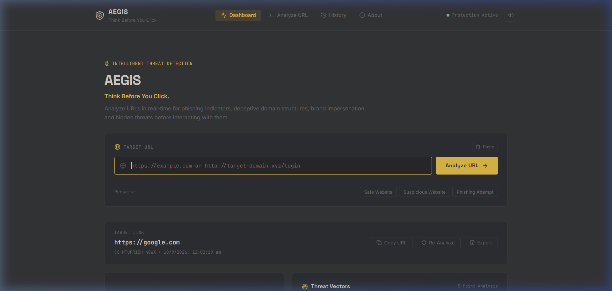
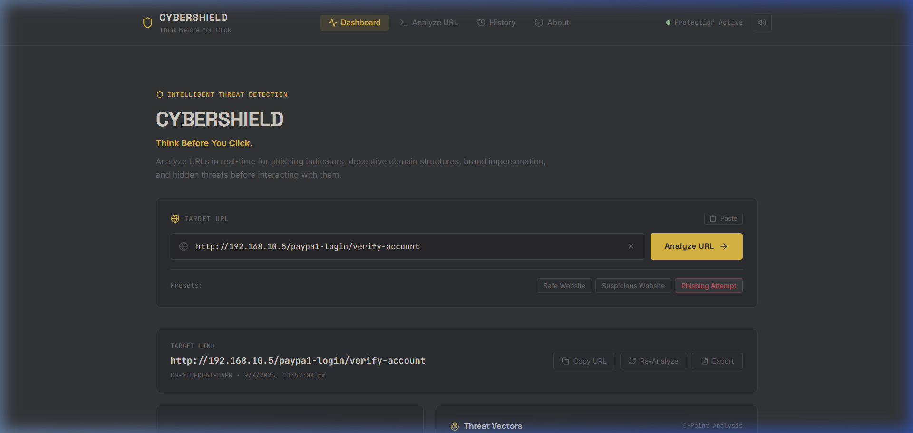
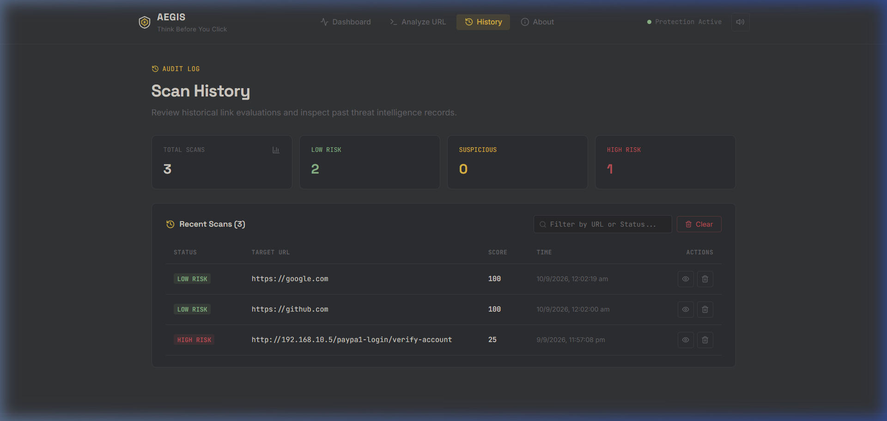
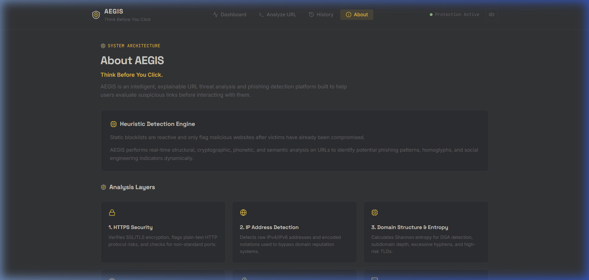

# 🛰️ LINKRADAR — Multi-Vector URL Threat Intelligence

<div align="center">



[](https://reactjs.org/)
[](https://nodejs.org/)
[](https://vitejs.dev/)
[](https://monkeytype.com/)
[](LICENSE)

**Think Before You Click.**  
*An intelligent, explainable URL security analysis engine and threat intelligence radar.*

[Live Demo](#-getting-started) • [Sample Benchmark Results](#-sample-threat-analysis-benchmark) • [Architecture](#-system-architecture) • [API Reference](#-api-specification)

</div>

---

## 📖 Overview

**LINKRADAR** is a modern cybersecurity platform engineered to identify zero-day phishing campaigns, deceptive lookalike domains, raw IP redirects, and social engineering vectors *before* users interact with them.

Unlike conventional threat blocklists that operate reactively, LINKRADAR evaluates the structural, cryptographic, phonetic, and semantic properties of target links in real-time across a 5-axis threat radar.

---

## 📊 Sample Threat Analysis Benchmark

Below is a benchmark summary demonstrating how LINKRADAR classifies different link risk tiers with explainable root causes:

| Target URL | Score | Risk Tier | Primary Heuristic Triggers | Recommendation |
| :--- | :---: | :---: | :--- | :--- |
| `http://192.168.10.5/paypa1-login/verify-account` | **18 / 100** | 🔴 **HIGH RISK** | • Raw IP routing<br>• Homoglyph (`paypa1` $\rightarrow$ PayPal)<br>• Plaintext HTTP<br>• Phishing keywords (`login`, `verify`) | ⛔ **CRITICAL:** Do not visit or enter credentials. Active phishing vector. |
| `http://secure-login-account.xyz/verify` | **42 / 100** | 🟡 **SUSPICIOUS** | • Disposable TLD (`.xyz`)<br>• Unencrypted HTTP<br>• Credential keywords (`login`, `verify`) | ⚠️ **CAUTION:** Unverified third-party domain. Verify via independent channel. |
| `https://google.com/search?q=cybersecurity` | **95 / 100** | 🟢 **LOW RISK** | • TLS 1.3 encryption<br>• Verified official domain infrastructure<br>• Clean Shannon entropy | ✅ **SAFE:** Standard browsing hygiene applies. |

---

## 📸 Screenshots & Interface

### 1. High-Risk Phishing Threat Report & 5-Axis Radar


### 2. Persistent Scan History & Audit Ledger


### 3. Heuristic Engine Methodology (About View)


---

## 🔍 Core Security Analysis Layers

LINKRADAR inspects every URL through six distinct security layers:

```
[ Target URL Input ]
         │
         ├─── 1. Protocol & Transport Layer  (HTTPS validation, non-standard ports)
         ├─── 2. Host & IP Detection Layer   (IPv4/IPv6, hex/octal bypass detection)
         ├─── 3. Domain Heuristics Layer     (Shannon entropy, DGA, TLD risk index)
         ├─── 4. Brand Impersonation Layer   (Levenshtein edit distance & homoglyphs)
         ├─── 5. Keyword & Social Eng Layer  (Authentication, financial urgency tokens)
         └─── 6. Threat Scoring & Radar      (0–100 score, explainability & 5-axis radar)
```

1. **🔒 HTTPS & Transport Security**: Verifies SSL/TLS encryption, flags plain-text HTTP protocol risks, and inspects non-standard service ports.
2. **📏 URL Length & Structure**: Flags excessive character lengths used to conceal redirect payloads.
3. **🌐 IP-Based Target Detection**: Identifies direct IPv4/IPv6 addresses, hex encodings, and octal notations used to bypass domain reputation systems.
4. **🌐 Domain Structure & Shannon Entropy**: Calculates mathematical entropy to expose Algorithmically Generated Domains (DGA), deep subdomain nesting, and high-risk disposable TLDs (`.xyz`, `.top`, `.click`, `.gq`, `.tk`).
5. **🎭 Brand Impersonation & Homoglyphs**: Detects lookalike substitutions (e.g., `paypa1`, `arnazon`, `g00gle`, `rn` $\rightarrow$ `m`, `0` $\rightarrow$ `o`, `1` $\rightarrow$ `l`) across monitored brands.
6. **⚠ Suspicious Keywords & Urgency Tokens**: Scans for credential harvesting and phishing bait triggers (`login`, `verify`, `password`, `wallet`, `urgent`, `reward`, `kyc`).

---

## 🏗️ System Architecture

LINKRADAR is built with a **Hybrid Full-Stack Architecture**:

```
d:/Dev/testing/ai-cyber/
├── server/
│   ├── server.js               # Express REST API (/api/analyze, /api/history, /api/health)
│   └── services/
│       ├── dnsScanner.js       # Live DNS resolution & A-record inspection
│       └── historyStore.js     # Server-side audit log store
├── src/
│   ├── components/             # Minimalist React UI components & SVG Radar Logo
│   ├── hooks/
│   │   └── useThreatAnalysis.js# Clean custom hook for analysis workflows
│   ├── pages/                  # Dashboard, Analyzer, History, About
│   ├── services/
│   │   ├── apiService.js       # Unified client caller with offline fallback
│   │   ├── ThreatAnalyzer.js   # Client-side heuristic analysis engine
│   │   └── StorageService.js   # LocalStorage audit ledger manager
│   ├── utils/
│   │   ├── URLParser.js        # URL normalization and IP parsing
│   │   ├── BrandDetector.js    # Levenshtein & homoglyph detection
│   │   ├── KeywordDetector.js  # Suspicious token parser
│   │   ├── DomainHeuristics.js # Shannon entropy & structural checks
│   │   ├── RiskCalculator.js   # Weighted scoring algorithm
│   │   └── cyberAudio.js       # Web Audio API feedback generator
│   └── index.css               # Monkeytype-inspired design system tokens
```

---

## 🚀 Getting Started

### Prerequisites
- Node.js (v18 or higher)
- npm

### Installation

```bash
# Clone the repository
git clone https://github.com/jisnu-glitch/aegis-security.git

# Navigate into project directory
cd aegis-security

# Install dependencies
npm install
```

### Running Locally

```bash
# Start both backend server (port 5000) and frontend client (port 5173) concurrently
npm run dev
```

Open **[http://localhost:5173](http://localhost:5173)** in your browser.

---

## 🔌 API Specification

### `POST /api/analyze`
Analyze any target URL for security vulnerabilities and phishing indicators.

**Request:**
```json
{
  "url": "http://192.168.10.5/paypa1-login/verify-account"
}
```

**Response:**
```json
{
  "success": true,
  "report": {
    "id": "RADAR-M3K9X-7A2B",
    "timestamp": "2026-09-10T21:10:30.000Z",
    "url": "http://192.168.10.5/paypa1-login/verify-account",
    "score": 18,
    "status": "HIGH RISK",
    "statusColor": "danger",
    "checks": {
      "https": { "result": "Insecure HTTP Protocol", "risk": "High" },
      "ipAddress": { "result": "IP-Based URL Detected", "risk": "High" },
      "brandImpersonation": { "result": "Possible PayPal Impersonation", "risk": "High" },
      "suspiciousKeywords": { "result": "2 Keywords Detected", "risk": "Medium" }
    },
    "explanation": [
      "The connection does not use HTTPS encryption.",
      "The URL targets a raw IP address directly rather than a registered domain name.",
      "Possible PayPal brand impersonation detected via homoglyph ('paypa1')."
    ],
    "recommendation": "CAUTION: Do NOT click this link or submit personal credentials."
  }
}
```

---

## ⚖️ Disclaimer

LINKRADAR provides real-time heuristic security assessments based on structural and syntactic URL indicators. This automated detection system does not guarantee that a domain is entirely harmless or compromised. Always practice zero-trust verification.

---

## 📄 License

Distributed under the MIT License. See `LICENSE` for more information.
